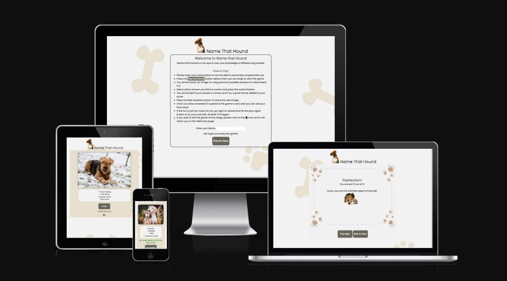
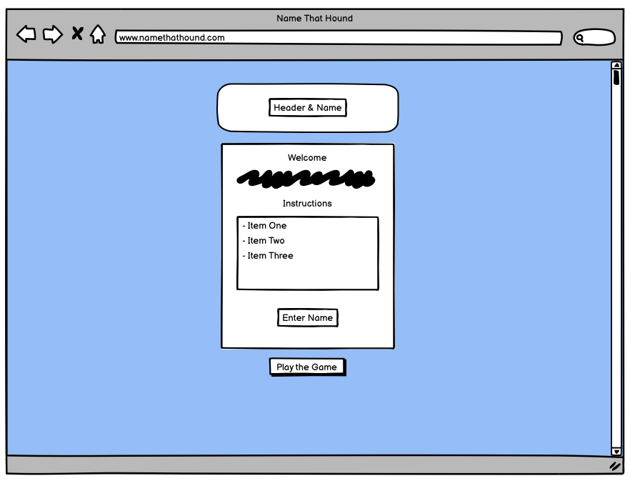
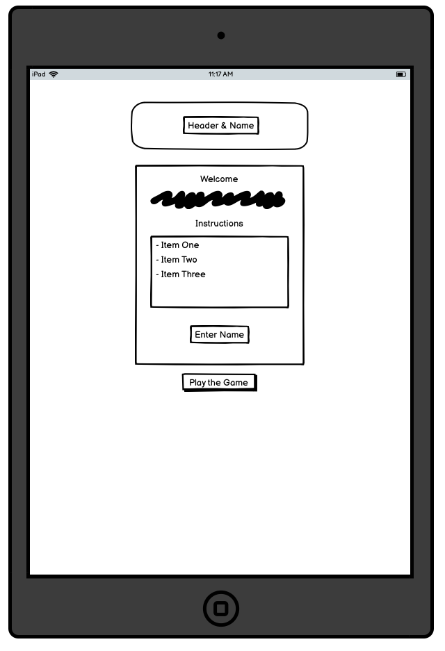
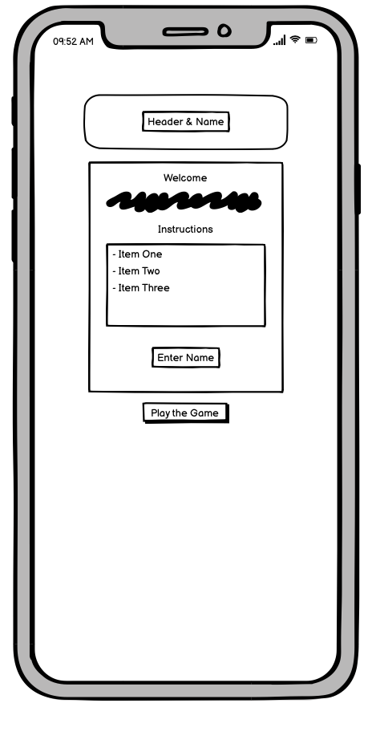
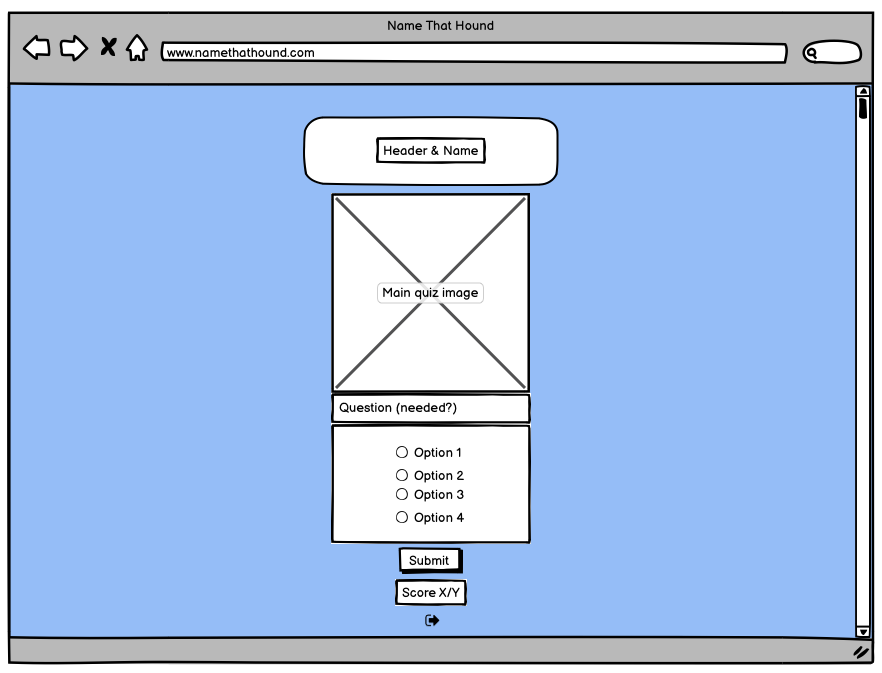
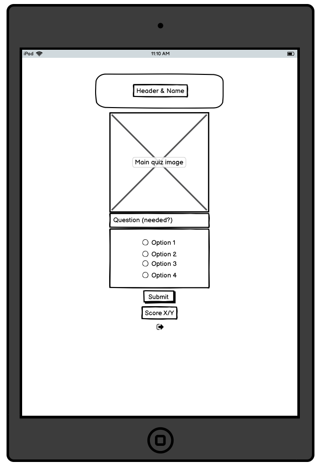
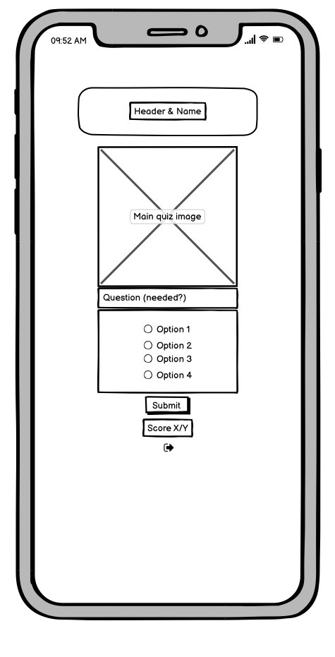
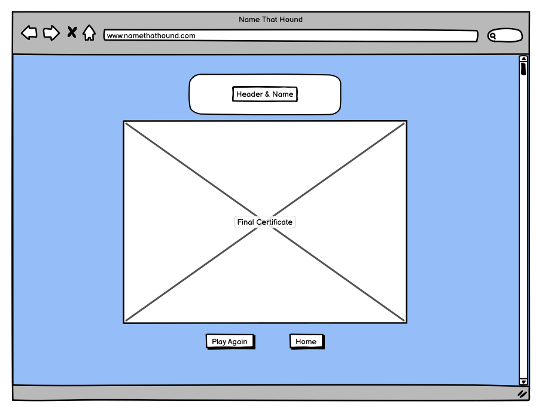
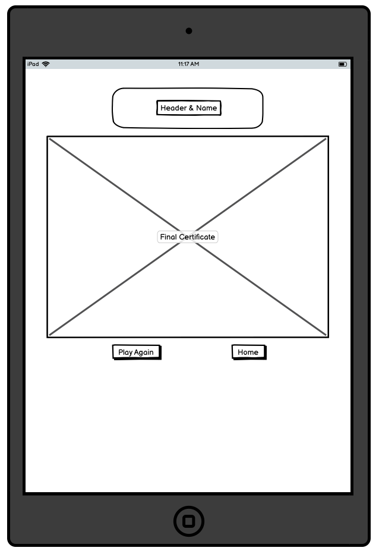
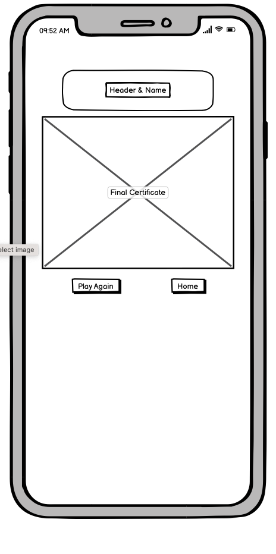

# Name That Hound 
***
## Overview 

Welcome to Name That Hound, a just-for-fun quiz to test your knowledge of dog breeds. As a dog lover myself, I wanted to create a fun quiz of 10 multiple choice questions that can be played and enjoyed by any age. Each round generates a fresh mix of images so the game can be played time and time again.

## Live Site

[Name That Hound](https://lw83.github.io/name-that-hound/)

## Repository 

[GitHub Repository](https://github.com/LW83/name-that-hound/)

***
## Concept & Planning 

### UX

- __Target Audience__

   - Individuals passionate about the animals and dogs in particular and keen to test their knowledge of the various dog breeds.
   - Children and adults looking to play a free fun online game.
   - Parents/grandparents looking for an entertaining but educational game for their children/grandchildren to play or to play with them.

- __User Stories__

   - As a user, I want a free fun and eductional online game to play.
   - As a user, I want to be able to understand how to play the game.
   - As a user, I want to be able to easily navigate my way through the game.
   - As a user, I want to be able to personalise my experience of the game.
   - As a user, I want to be able to dictate the length of time I play.
   - As a user, I want to get feedback on my answers and progress in the game. 
   - As a user, I want to see my final score and have a conclusion to the game.
   - As a user, I want to be able to play the game again easily if I choose.
   - As a user, I want a different experience each time I play the game.

- __Site aims__
 
  - The site aims to meet the above user requirements through the following: 
    -  Providing a free, online, education game to meet the target audience requirements.  
    -  Providing clear game instructions at the outset.
    -  Providing an easy and intuitive way to start, navigate and end or exit the game. 
    -  Enabling the user to personalise their game experience by submitting their name. 
    -  Enabling the user to play the game multiple times or to exit the game if they wish. 
    -  Providing feedback to the user throughout the game on their score and their answers to facilitate a learning experience. 
    -  Providing a game conclusion and overall final score and congratulatory message personalised to the user based on their score. 
    -  Providing an easy mechanism for the user to replay the game as many times as they wish. 
    -  Ensuring the user has a different experience of the game each time they play to ensure they wish to return to the game and to further the educational aspect of the game. 

### Wireframes
 Once I had decided on the theme for the site, I used Balsamiq to do some high level wireframes for the desktop and mobile versions of the site:

 __Welcome Page__
  
  - The homepage or welcome container was to welcome the user to the site, set out how to play the game and enable them to commence the game itself. 

 
 
 

 __Game Page__
  
  - The main gamepage sets out the generated dog image, the multiple choice answers and a submit button. The user also has the option to exit the game if they wish. 
  - Originally, I considered including a question line but in building the site I abandoned this as I felt it was intuitive and a waste of screen space to include a repeat 'What dog breed is this?' line. 

 
 
 

__Final Page__
  
  - The final page sets out a certificate image to congratulate the user on their final score. This screen also enables the user to play the game again or return to the Welcome page. 

 
 
 

### Color Scheme
- To decide on the color scheme for the site, I first selected the background-image. This image was selected from [Abode Images](https://.com/).
- Once I had decided on the image, I used [Image Color Picket](https://imagecolorpicker.com/en) to identify different colors within the image to use as the basis for font, border and icon colors within the site. 
- In order to ensure the colors selected had sufficient contrast to meet accessibility requirements, I validated the color palette using [Eight Shapes Contrast Grid](https://contrast-grid.eightshapes.com).

### Fonts
 - The fonts utilised are consistent across the page and are from [Google fonts](https://fonts.google.com/). 
 - The font for the logo and navigation bar is . I chose this font  
 - For the body of the site, I have used . I chose this font for the main body  
 - Sans serif has been applied as a backup font for both. 

***
## Existing Features 

### Header & Navigation

__Logo__

  - The logo 

  

__Navigation__

  - 

__Favicon__

  -  A favicon has been added to show up in the title of the page and is consistent with the icon used in the logo itself. 
  
  

### Footer

  - 

### X Page

  - The 

### X Page

  - The 

### X Page

  - The 

***
## Potential Future Features

 - Potential additional future features for the site include: 
      - 
       
***
## Testing 

### User Stories Testing

### Features Testing

### Responsiveness Testing
 - Responsiveness of the site was tested using Dev Tools for all screen size widths from 320px up to 1750px.
 - Responsiveness was also specifically checked for the following devices within Dev Tools:
      - iPhone SE
      - iPhone XR
      - iPhone 12 Pro
      - Pixel 5
      - Samsung Galaxy S8+
      - Samsung Galaxy S20 Ultra 
      - iPad Air
      - iPad Mini
      - Surface Pro 7 
      - Surface Duo
      - Samsung Galaxy A51/71
      - Nest Hub
      - Nest Hub Max
 - Specific breakpoints for each page were identified and managed through media queries. These were focused on adjusting the layout of boxes on the page, the size of margins and padding and also adjusting the font-size for smaller screen sizes. 
 - I did not use Flexbox or CSS Grid in this project as I wanted to better familiarise myself and understand the float model but plan to use one or both of these newer methods in a future project. 

### Browser Testing
  - The site was developed and tested using Google's Chrome browser. 
  - The site has also been tested on Safari and functions as intended. 

### Accessibility Testing 

  - The accessibility of the site has been tested through the following tools: 

    - Dev Tools Lighthouse Report (screenshot included in Validation Testing section below)
    - [Wave (Web Accessibility Evaluation Tool)](https://wave.webaim.org/)
          [Wave Homepage Test]()
          [Wave Events Page Test]()
          [Wave Tips Page Test]()
    - [A11y project checklist](https://www.a11yproject.com/checklist/) 

  - The following aspects of the site development have been specifically included with accessibility in mind and as recommended by the above sources: 
    - 
 
### Code Validation Testing 

__HTML Validation__
  - No errors were returned for any of the pages in the site when passing through the official W3C Validator. 
  

__CSS Validation__
  - No errors were found when passing through the official W3C Validator.
  

__Lighthouse Report__
  - In addition to the HTML and CSS Validation, I generated a lighthouse report for the site pages through Dev Tools.

  

  

  In addition all links within the site have been tested to ensure they are functioning as intended. 

### Fixed Bugs
 - Bugs: 
1) Bringing in images: Challenges; files paths, bringing into DOM (typos in template literals)
2) Generating random answers and pushing into an array
3) Lining up answers with radio buttons - put in a break after each line changed line from [i] to answerOptions[i] (brought in name of dog as opposed to a number) - was pushing radio options in with string of all options. pushed to new array and (final options) and pulled that into the DOM
4) Not picking up the value of the radio button selected - hadnt applied a value in creation of radio buttons, included value to reflect assigned random answer and retested and worked.
5) Original code:  /**function generateAnswerOptions () {
        let newNum = Math.floor(Math.random() * dogs.length);
        let addDogs = dogs[newNum];
            return addDogs.name;
    }
        
    for (var i = 0; i < 3; i++) {
            generateAnswerOptions ();
            answerOptions.push(generateAnswerOptions());
        }**/

        In certain cases was throwing up a duplicate option either correct or incorrect - wanted to ensure 4 unique options presented

### Unfixed Bugs
- During the project there were a couple of ideas I had which I found were not possible to implement for various reasons, so whilst not stricly unfixed bugs these included:
  - Focus on radio buttons
  - Duplicate images

***
## Deployment

- The site was deployed to GitHub pages following the below deployment steps: 
  - In the GitHub repository, navigating to the Settings tab 
  - From the source section drop-down menu, selecting the Master Branch
  - Once the master branch was been selected, the page automatically refreshed with a detailed ribbon display to indicate the successful deployment. 

The live link can be found here: [Name That Hound](https://lw83.github.io/name-that-hound/) 

***
## Credits  

### Media
 - The winking dog image utilised in the final certificate was taken from [ImgFlip](https://imgflip.com/).
 - All other dog images used in the site have been taken from [DogTime](https://dogtime.com) and copyright remains with this source.
 - The background image used for the site has been downloaded from [Adobe Stock Images](https://stock.adobe.com/ie/). 
 https://www.istockphoto.com/search/2/image?mediatype=illustration&phrase=dog+borders - certificate border

### Languages Used
  - HTML5
  - CSS3
  - Javascript

### Tools & Online Resources Utilised
 - The following tools and resources have been utilised in the creation of this project: 
     - [Balsamiq](https://balsamiq.com/): For creation of wireframes. /
     - GitHub & Gitpod: For development and deployment of the site. /
     - [Image Color Picker](https://imagecolorpicker.com/en): To match colours from the background image for use in color theme of site. /
     - [Google Fonts](https://fonts.google.com/): For site fonts. /
     - [Compressor.io](https://compressor.io/): For compressing image file sizes. /
     - [Font Awesome](https://fontawesome.com/): For icons used across the site. /
     https://www.remove.bg/upload to remove background of images for use in header
https://www.simpleimageresizer.com/upload to resize image
     - [W3 Schools](https://www.w3schools.com/js/js_random.asp): For general guidance and research and for further direction on how to create a random number used for generating image in game.  
     - [Code Grepper](https://www.codegrepper.com/code-examples/javascript/how+to+access+variable+outside+function+in+javascript): To 
     - [Stack Overflow](https://stackoverflow.com/questions/19089018/how-to-align-form-at-the-center-of-the-page-in-html-css): For general guidance and research and for how to centre form.
     - [WAI Test](https://www.w3.org/WAI/test-evaluate/preliminary/): For accessibility checks
     - [Wave (Web Accessibility Evaluation Tool)](https://wave.webaim.org/): For accessibility checks
     - [A11y project checklist](https://www.a11yproject.com/checklist/): For accessibility checks
     - [Eight Shapes Contrast Grid](https://contrast-grid.eightshapes.com): For color contract checks
     - [Slack](https://slack.com/intl/en-ie/): For general guidance and research on project considerations, positioning and sizing. 
     - [GitHub Community Forum](https://github.community/): For guidance on resolving image load on deployment of site. 
     - Google Chrome Dev Tools: For validation and responsiveness checks
     - [Am I Responsive](https://ui.dev/amiresponsive): To create the multi-device screenshot for inclusion in my Readme file. 
     - [W3C CSS (Jigsaw) Validator](https://jigsaw.w3.org/css-validator/)
     - [W3C HTML Validator](https://validator.w3.org/)
     - Code Institute & Love Maths Demonstration: For guidance and inspiration for this site. 

### People
 - In addition a big thank you to the following people for their assistance in this project:
     - Kasia Bogucka: Our cohort facilitator for keeping us all on track and answering all and any of the many questions!
     - My cohort: For our weekly checkins and tips
     - Mike Avgeros: For responding to my query on Slack 

Resources: 
https://stackoverflow.com/questions/70983009/im-creating-a-quiz-with-5-random-questions-out-of-an-array-with-20-i-want-to
https://stackoverflow.com/questions/11922383/how-can-i-access-and-process-nested-objects-arrays-or-json
https://stackoverflow.com/questions/5915096/get-a-random-item-from-a-javascript-array
https://stackoverflow.com/questions/44008092/how-to-call-a-function-multiple-times
https://stackoverflow.com/questions/2450954/how-to-randomize-shuffle-a-javascript-array
https://www.sitepoint.com/simple-javascript-quiz/ to push answeroptions to mc radio buttons
https://stackoverflow.com/questions/7275597/getting-the-selected-radio-without-using-id-but-name
https://developer.mozilla.org/en-US/docs/Web/API/Document_object_model/Locating_DOM_elements_using_selectors
https://stackoverflow.com/questions/2380019/generate-unique-random-numbers-between-1-and-100
https://sebhastian.com/javascript-show-hide-div-onclick-toggle/#:~:text=To%20display%20or%20hide%20a,which%20is%20block%20)%20to%20none%20. - assistance in how to show and hide divs for different sections of the game
